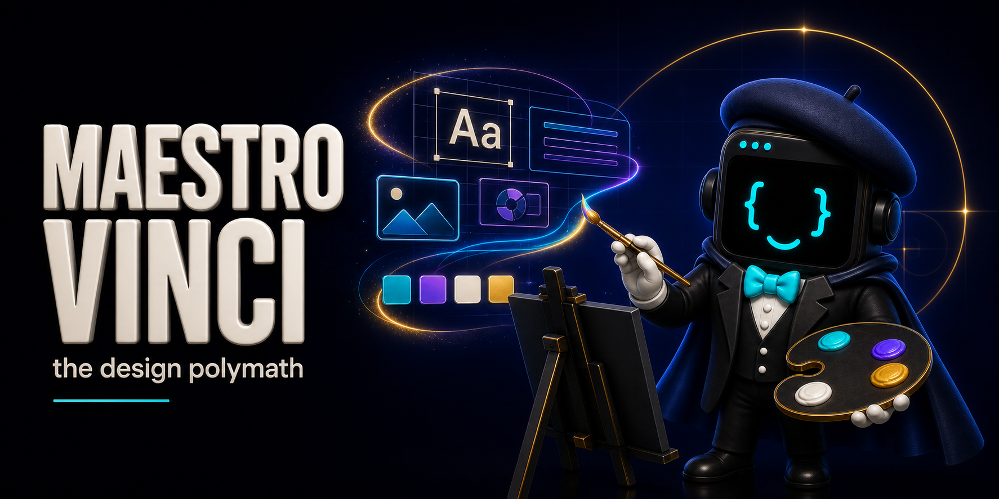

<p align="center">
  
</p>

<h1 align="center">Maestro: Vinci</h1>

<p align="center"><strong>Turn ideas into unmistakable design.</strong></p>

<p align="center">
  <a href="https://github.com/mbanderas/maestro-vinci/actions/workflows/validate.yml"></a>
  <a href="LICENSE"></a>
</p>

A website can work perfectly and still leave no impression. An app can feel polished and still look like everything else. Maestro: Vinci gives Codex, Claude Code, and Agent Skills-compatible hosts a creative partner for websites, apps, product experiences, brands, decks, reports, and visual systems.

Vinci turns a brief into a clear point of view, then carries that direction through layout, typography, color, imagery, motion, interaction, and the details that make the work unmistakably yours. It can create, redesign, critique, or refine while respecting the product and design system already in place.

> Direction before decoration. Character without imitation. Craft all the way through.

## Why Vinci exists

Most coding agents can assemble the pieces. Vinci shapes them into a coherent design. Typography, color, composition, motion, imagery, interaction, and responsive behavior all serve the same creative idea.

- **A real creative direction:** Every project gets an idea, mood, visual language, and deliberate point of view.
- **Made for the work in front of you:** Vinci reads the audience, content, brand, and product before choosing a style.
- **Broad creative range:** Websites, apps, product UI, brands, decks, reports, campaigns, prototypes, and design systems.
- **Taste with practical depth:** Beautiful composition and expressive detail, carried through responsive states, accessibility, and real content.
- **An exacting final eye:** Vinci finds what weakens the finished work and keeps refining until the design holds together.

## What Vinci brings

| Capability | What it does |
|---|---|
| Websites and landing pages | Creates expressive marketing, editorial, portfolio, campaign, and conversion experiences |
| Apps and digital products | Shapes product UI, interaction states, onboarding, dashboards, flows, and responsive behavior |
| Brand and art direction | Builds a visual point of view through typography, color, imagery, composition, and motion |
| Decks and reports | Turns ideas, research, and strategy into clear, compelling visual stories |
| Creative direction and critique | Finds the strongest visual idea, identifies what weakens it, and gives the work a sharper point of view |
| Design systems | Reads and extends existing tokens, components, patterns, and interaction grammar without silently replacing them |
| Originality and distinction | Pushes past generic templates without borrowing another brand's identity |
| Inclusive design | Builds accessibility, keyboard use, responsive behavior, reduced motion, and zoom into the creative work |
| Final polish | Renders the work, inspects what people will actually see, fixes visible problems, and checks it again |

## Install from GitHub

### Codex

```sh
codex plugin marketplace add mbanderas/maestro-vinci
codex plugin add maestro-vinci@maestro-vinci
```

### Claude Code

```text
/plugin marketplace add mbanderas/maestro-vinci
/plugin install maestro-vinci@maestro-vinci
```

Start a new task or restart the host after installation so its skill registry reloads.

### Portable local install

Clone the repository, then install the reviewed skill for Codex, Claude Code, or both:

```sh
git clone https://github.com/mbanderas/maestro-vinci.git
cd maestro-vinci
node scripts/install.mjs --target universal --scope user
```

The universal user install writes to:

- `~/.agents/skills/vinci` for Codex and Agent Skills-compatible hosts;
- `~/.claude/skills/vinci` for Claude Code.

Select one host, project scope, or a dry run:

```sh
node scripts/install.mjs --target codex --scope user
node scripts/install.mjs --target claude --scope project
node scripts/install.mjs --target universal --scope project
node scripts/install.mjs --target universal --scope user --dry-run
```

Use `--force` only when replacing a different copy at the exact `vinci` destination.

### npm

After npm publication, install the same reviewed skill for shared Agent Skills and Claude Code:

```sh
npx -y @maestrovinci/vinci
```

The npm package is not published yet. The GitHub and local installation paths above are available now.

## Invoke Vinci

Use `$vinci` in Codex or `/vinci` in a host that exposes skills as slash commands:

```text
$vinci Give this website a stronger creative direction. Make it feel unmistakably ours, not like another startup template.
```

```text
/vinci Design this app onboarding flow from first impression through loading, error, empty, keyboard, reduced-motion, and mobile states.
```

```text
/vinci Turn this strategy into a cinematic pitch deck with a clear narrative, strong typography, and a visual system we can own.
```

## From brief to finished work

1. Vinci classifies the task mode and change scope independently.
2. It inspects target-repository instructions, tokens, components, content, states, and same-type shipped surfaces.
3. It states a direction in observable terms before styling.
4. It builds semantic structure, layout, typography, surfaces, states, responsive behavior, motion, and imagery in that order.
5. It stress-tests realistic content and edge states while building.
6. It renders required frames, inspects the pixels, repairs confirmed defects, and re-renders.
7. It returns the finished work or critique, the creative reasoning behind it, and any remaining limitations.

## Built for

- founders who want their website or product to look as distinctive as the idea behind it;
- product teams that need creative range without replacing a working design system;
- engineers who want strong design decisions expressed as buildable structure and responsive behavior;
- designers who want a sharp creative partner for direction, critique, and final polish;
- teams turning strategy, research, or stories into decks, reports, campaigns, and branded visuals.

## Included knowledge

The public skill contains:

- a portable Vinci runtime adapter and persona;
- condensed design doctrine;
- the 19-chapter craft manual and two delivery checklists;
- visual quality and finish checks;
- a safe visual-validation loop;
- a metadata-only catalog of bounded public design observations, patterns, source URLs, risks, and do-not-copy rules.

The package excludes raw external images, training sources, audits, holdouts, private memory, meta-prompts, browser profiles, databases, logs, and private Git objects or history. The [export manifest](EXPORT_MANIFEST.json) records public release provenance, input hashes, transformations, and the exclusion boundary without disclosing a private source repository or commit identifier.

## Creative integrity

Vinci uses references to expand possibility, not to copy style. It studies composition, typography, interaction, imagery, and visual patterns while leaving another brand's identity, wording, artwork, and code untouched.

When Vinci creates visual work, it inspects the actual result, fixes visible problems, and checks it again. If a render, browser check, or accessibility review cannot run, Vinci states what remains unchecked.

## Great products deserve to be found

Vinci makes the product worth remembering. **[CiteSurge](https://citesurge.com)** helps make it the answer people find in AI search. See how answer engines present your brand, find what is missing, and turn the gaps into content, technical, media, and GEO work.

## Development

Requirements: Node.js 18 or later and npm.

```sh
npm ci
npm run check
```

`npm run check` validates manifests and skill structure, runs installer and release-tool tests, scans package hygiene, and inspects the exact npm archive allowlist.

The repository is cross-platform. CI runs the full check on Windows and Ubuntu.

## Legal and security

- [License](LICENSE)
- [Privacy](PRIVACY.md)
- [Security](SECURITY.md)
- [Disclaimer](DISCLAIMER.md)
- [Third-party notices](THIRD_PARTY_NOTICES.md)
- [Asset provenance](assets/PROVENANCE.md)
